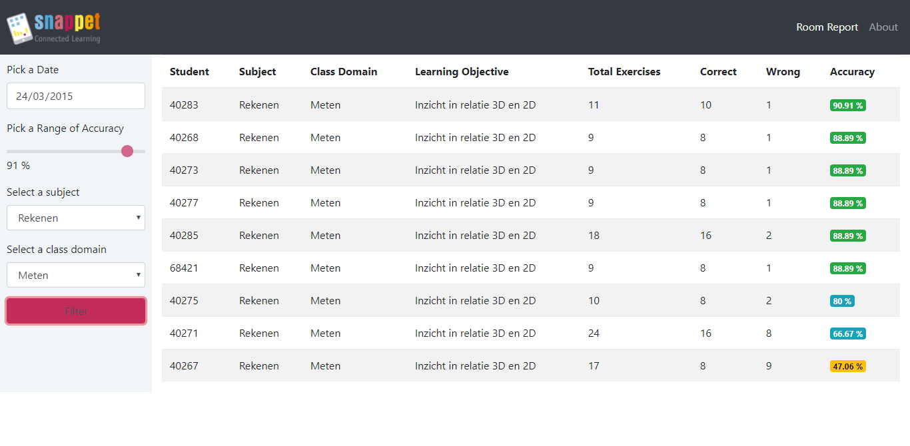

# SnappetChallenge

My idead for this challenge was to create an entire full stack application, so I developed from database to frontend. I've used for this project the following stack: MySql (Database), C# .Net Core 2.0 Web Api (Backend) and Angular 4 (Frontend).

The project is divided into 3 main folders: *infrastructure*, *backend* and *frontend*

## Infrastructure

I created a table using the data inside the .csv file provided by the challenge and created a stored procedure to process the report query. To setup your database to run this project, follow steps bellow:

- For the database, I used MySQL in a virtual environment using Vagrant. If you want to setup the same environment, you need to install vagrant first. Then just run:

```bash
cd infrastructure
vagrant up
```

You'll have a database configured and running.

- I copied and renamed the **work.csv** into new file called **Students.csv** (this will be the name of our Table)

- The second step is to run the setup_database.sql script that is located inside the infrastructure folder:

```bash
mysql -u root -p < setup_database.sql
```

- And just load the csv into our brand new table

```bash
mysqlimport --ignore-lines=1 --fields-terminated-by=, --local -u root -p Snappet Students.csv
```

Now you have our database, table and stored procedure created

## Backend

The backend is based on .NET Core 2.0. You'll need to have it installed. After that you have to run:

```bash
cd backend
dotnet restore
dotnet build
dotnet run
```

You'll have the backend running on: http://localhost:5000/

## Frontend

The frontend part was developed using NPM and Angular 4, so you need to install Node.js in order to get all NPM packages. To install all its dependencies just run:

```bash
cd frontend
npm install
npm start
```

You'll have the frontend running on: http://localhost:4200/


