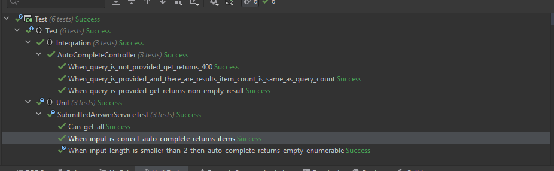
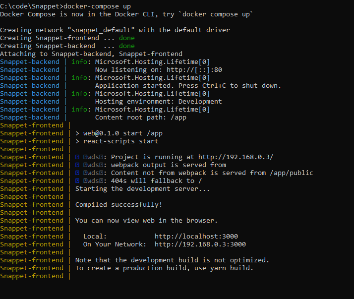
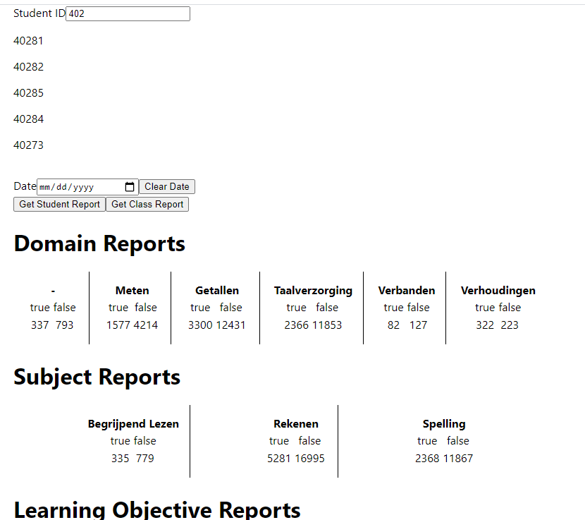

# Snappet Challenge
I implemented a simple project for the snappet challenge. I tried to spend as less time as possible to come up with a simple idea while abandoning lots of product ideas and technical possibilities to implement. My main aim is to talk about the code and the possibilities.

### Technologies
I have used
- .net 5 for the backend
- reactjs, typescript for the front-end
- docker & docker compose to build up the environment
- nunit, moq & aspnetcore test host for testing 

### What I did
- I created a simple back-end solution to load provided data on the startup. I decided not to use an in memory database since using it or not using it doesn't effect too much things while implementing it requires a little time.

- I used simple web api to communicate with the front-end. Considering different data format & possible interesting reports in a real world scenario I would consider graphql like communication infrastructures too.

- I used a simple factory pattern to create a dynamic set of auto complete functionality. At the end I only used user id auto complete but I left it in the project just to talk about it.

- I created a unit test project with 2 files. One is pure testing for services with all dependencies faked, the other creates a test host to make real calls to the api. I created few examples to not to spend too much time on it.

- I used dockerfiles and docker compose to run the project with one command.

- I decided not to use any css library to not to spend too much time on it. But with altering data a little and using correct libraries, front-end of the application would be more beautiful.

- I used typescript and react hooks to create create a workable front-end with some reusable components. I was thinking about using css modules but then I decided not to include extra libraries. 

- I was thinking about the "What a teacher would like to see", then I decided to go with a simple solution for the problem again. I didn't cover "progress" so I am unhappy about that. But again the decision making is all time based.

- As a result, I show how many true and how many false answers are made for the whole class, or a specific student with possible day selection.

